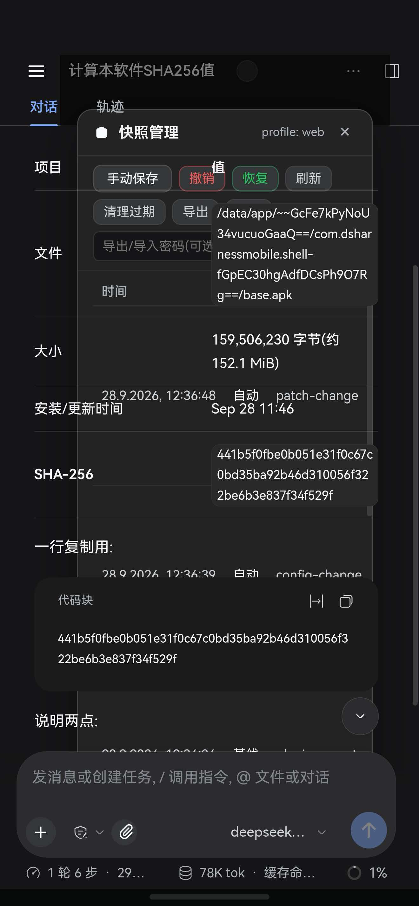
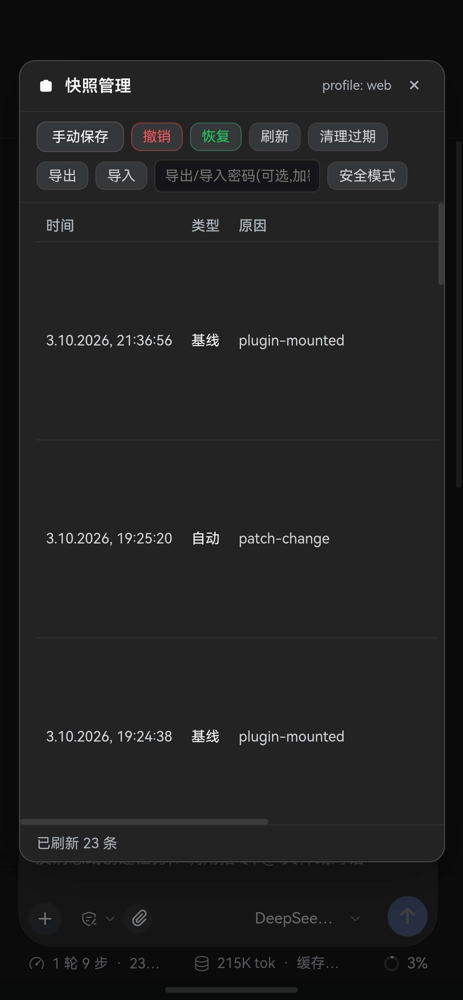

# Issue #288 设备实测证据（华为 SGT-AL10）：修复前 / 修复后

本目录存放 issue #288「快照管理面板被会话代码块盖住」修复的**设备截图**，用于修复前后对比。入库目的是让评审者能直接在 PR 里看到图 —— `docs/AGENTS/emulator-test-protocol.md` §6 规定截图落在 `.deploy-tmp/<round>/`（已在 `.gitignore` 内），那种路径在 GitHub 上**不可见**。

## 修复前 / 修复后

| 修复前 | 修复后 |
|---|---|
|  |  |
| `ui-00-BEFORE-panel-covered-by-codeblock.jpg` | `ui-01-snapshot-panel-SGT-AL10-20261003-213933.jpg` |

### 差异（人眼可判读，不需要看懂代码）

| | 修复前 | 修复后 |
|---|---|---|
| 会话正文里的 `代码块` 卡片 | **叠在面板上层**：卡片与面板行文字混在一起，`时间 / 大小 / SHA-256` 等行被压住 | **不再出现于面板之上**：面板整块覆盖正文 |
| 面板按钮区 | 被 `值 …/data/app/…` 长文本盖住 | 「手动保存 / 撤销 / 恢复 / 刷新 / 清理过期 / 导出 / 导入 / 导出-导入密码 / 安全模式」完整可读 |
| 面板列表 | 与代码块文字互相穿插，`自动 patch-change`、`config-change` 等行压着正文 | 快照列表完整：23:36:56 基线 `plugin-mounted`、19:25:20 自动 `patch-change`、19:24:38 基线 `plugin-mounted`；底部「已刷新 23 条」 |
| 遮罩范围 | 遮罩未能覆盖正文，代码块从中间穿出 | 遮罩覆盖整屏；面板下方输入区与状态行（1 轮 9 步 / 215K tok / 3%）照常可见 |

## 证据元数据

| 文件 | 来源 | 尺寸 | 字节 | SHA-256 |
|---|---|---|---|---|
| `ui-00-BEFORE-panel-covered-by-codeblock.jpg` | issue #288 正文附图（`snoworwind/dsh-mobile-apk` 的 `evidence/device-screenshots` 分支，`evidence/issue-snapshot-panel-stacking.jpg`） | 1320x2848 | 158128 | `4c6bee3178e3232efc0b1792b5bd0dff48756c1e29ffa987c5bb71581d0ed4da` |
| `ui-01-snapshot-panel-SGT-AL10-20261003-213933.jpg` | 用户提供的修复后实测截图 | 1320x2848 | 105633 | `aa634ff9601735023a780e0cc7a0d90819980efa240e2557673b2c9fcefea097` |

设备均为华为 SGT-AL10（用户报告 0.14.2 / 0.14.3 均复现该缺陷）。

**两张图的构建代次不同，如实标注**：修复前那张来自 issue 报告时的环境（issue 正文记录 `0.14.2-fx-2-source` / versionCode 43）；修复后那张来自本轮修复构建（`0.14.3-source` / versionCode 45）。因此两张图是**同一机型、同一操作、跨版本的前后对照**，不是同一构建的 A/B。

## 结论表

| 步骤 | 操作 | 预期 | 截图 | 结论 |
|---|---|---|---|---|
| 1 | 打开会话顶部入口的「快照管理」 | 面板及其遮罩覆盖整屏，正文（含代码块）不得压在其上 | `ui-00-BEFORE-…jpg`（修前，不满足） | 复现缺陷 |
| 2 | 装修复版后同一操作 | 同上 | `ui-01-snapshot-panel-…jpg`（修后，满足） | 通过 |

## 证据性质与边界（不得读成「三层验收全绿」）

- 这是**结果证据**：修前复现、修后消失，均由真机截图给出。
- **不是**可重跑的自动化套件：验收当时设备未接 adb（`adb devices` 为空），因此没有 `input tap` 命令序列、`uiautomator dump` 与逐帧 `screencap` 留档。
- **CDP 层（A 轨）本轮未跑**：跨层状态语义、面板开关状态机仍待补。设备层证明「人能看见并用上」，CDP 层证明「状态语义正确」，两者不互相替代。
- 旧 WebView 的包含行为此前是机制模拟，不冒充旧内核实测。

## 相关

- 修复 PR：[kelai141/dsh-mobile-apk#321](https://github.com/kelai141/dsh-mobile-apk/pull/321)
- 原始报障：issue #288
- 根因与修法见该 PR 描述，以及 `docs/AGENTS/gotchas.md` 的坑 242。
